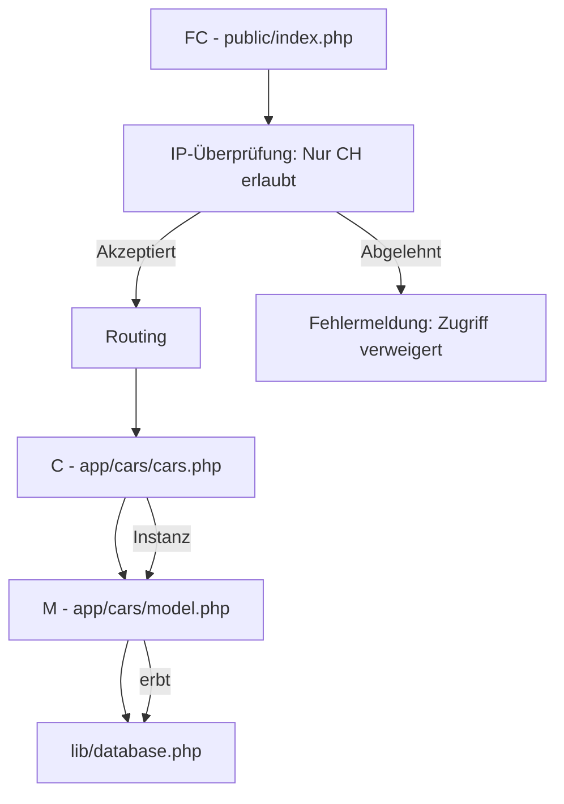

# M295
- MD - Dateien Vorschau: Ctrl + Shift + V
- Erweiterung zum mermaid anzeigen: Markdown Preview Mermaid Support von Matt Bierner

## Links zum Aufrufen
- Seite öffnen: http://M295.tag5.local
- http://M295.tag5.local/cars/getData/4

## composer
```shell
    composer install
```

## Diagramm



# PHPStan


Level 0: Auf dieser Stufe führt PHPStan grundlegende Überprüfungen durch. Es erkennt unbekannte Klassen und Funktionen, prüft auf unbekannte Methodenaufrufe auf $this und überwacht fehlerhafte Argumente, die an diese Methoden und Funktionen übergeben werden. Des Weiteren wird noch die Verwendung von immer undefinierten Variablen überprüft.
Level 1: Auf dieser Stufe konzentriert sich PHPStan auf die Verwendung von Variablen, welche möglicherweise (also unter gewissen Bedingungen) undefiniert Variablen. Es wird nach unbekannten magischen Methoden und Eigenschaften in Klassen gesucht, die über __call und __get aufgerufen werden könnten.
Level 2: Hier erweitert PHPStan seine Untersuchung und überprüft unbekannte Methoden in allen Ausdrücken, nicht nur auf $this. Außerdem erfolgt eine Validierung der PHPDoc-Kommentare.
Level 3: PHPStan analysiert auf dieser Stufe die Rückgabetypen von Funktionen und Methoden sowie die zugewiesenen Typen für Eigenschaften.
Level 4: Dieses Level beinhaltet grundlegende Überprüfungen auf “toten” Code. PHPStan identifiziert Code, welcher durch immer falsche Bedingungen nicht ausgeführt wird und unerreichbaren Code, der nach einer return-Anweisung folgt.
Level 5: PHPStan untersucht auf dieser Stufe die Typen der an Methoden und Funktionen übergebenen Argumente und stellt sicher, dass sie den erwarteten Typen entsprechen.
Level 6: Hier werden fehlende Typhinweise im Code gemeldet, um sicherzustellen, dass alle Variablen und Funktionen mit den entsprechenden Typen dokumentiert sind.
Level 7: Auf dieser Stufe beginnt PHPStan, teilweise falsche Unionstypen zu melden. Wenn beispielsweise eine Methode aufgerufen wird, die nur für einige Typen in einem Unionstyp existiert, gibt Level 7 eine Warnung aus. Es erkennt auch andere möglicherweise inkorrekte Situationen.
Level 8: PHPStan meldet das Aufrufen von Methoden und den Zugriff auf Eigenschaften bei nullable Typen. Vor einem Aufruf auf nullable Objekt muss programmatisch sichergestellt sein, dass das Objekt bereits initialisiert wurde.
Level 9: Diese Stufe erzwingt eine strikte Handhabung des mixed-Typs. Die einzige erlaubte Operation mit diesem Typ ist das Weiterreichen an einen anderen mixed-Typ.