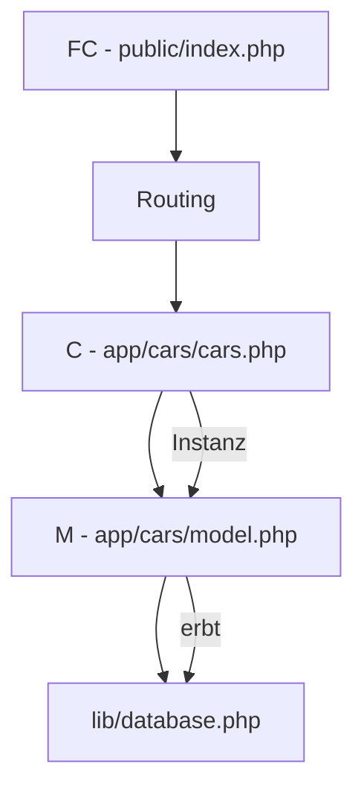

# M295
- MD - Dateien Vorschau: Ctrl + Shift + V
- Erweiterung zum mermaid anzeigen: Markdown Preview Mermaid Support von Matt Bierner

## Links zum Aufrufen
- Seite öffnen: http://M295.tag4.local
- http://M295.tag4.local/cars/getData/4

## composer
```shell
    composer install
```

## Diagramm
